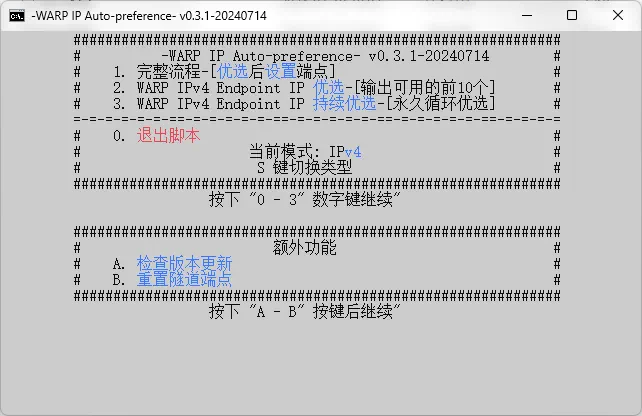

  

# WARP IP Auto-preference
WARP IP Auto-preference (以下简称WIPAP) 是一个用于优选Cloudflare WARP IP的脚本  
修改自<https://gitlab.com/Misaka-blog/warp-script/-/blob/main/files/warp-yxip/warp-yxip.bat>的脚本

---

## 功能

 * 自动优选并设置warp-cli的隧道端点 (IPv4/IPv6)
 * WARP Endpoint IP 优选 (自动排除不可用的IP) (IPv4/IPv6)
 * WARP Endpoint IP 持续优选 (循环执行) (IPv4/IPv6)
 * 可检查脚本更新
 * 重置 Endpoint

---

## 如何使用

1. 直接下载源码中的`WIPAP.bat`
2. 新建一个空文件夹
3. 放入`WIPAP.bat`
4. 双击运行即可

---
## 错误排查

#### **如果运行后立刻退出**
据我所知, 使用 Microsoft Edge 浏览器有可能会出现这种问题, 试试复制为一个新文件

#### **如果出现中文乱码**
将`WIPAP.bat`编码格式转为 ANSI

如果出现其他问题, 请在`Issues`中提交

---

## 提醒

本脚本中下载的程序来自原脚本的下载URL路径, 由此文件引发的问题与本脚本无关  
Ps: 代码写的很难看  
